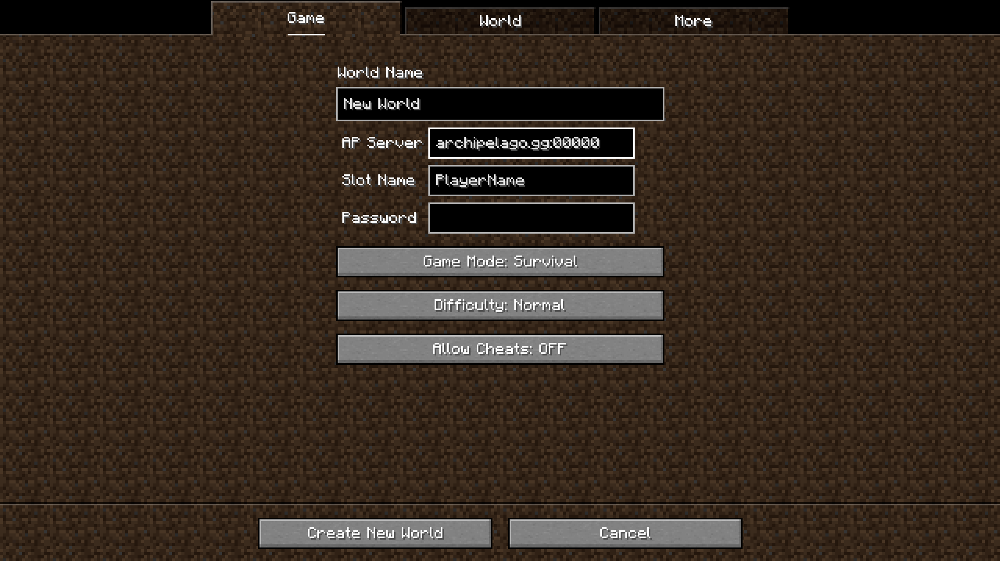

> [!WARNING]
> Right now this mod is still in a very early stage, so do keep in mind that this mod could generate a Randomized Game that is unbeatable!


# [Archipelago](https://archipelago.gg/) Randomizer for Minecraft

This mod is inspired by [Minecraft_AP_Randomizer](https://github.com/jacobmix/Minecraft_AP_Randomizer), but is written in Fabric instead of Forge. It also has additional features such as easier setup, and the ability to play in singleplayer mode.

This repo contains the .apworld file to install in the Archipelago launcher. The Fabric mod is [located here](https://github.com/Deadlydiamond98/MinecraftFabricArchipelagoMod).

## Items

Item recipes, and some mechanics (like jumping, swimming, and running) are locked behind items found by you/other players. Filler items are also included such as experience drops, arrows, planks, and food.


## Locations (sending items)

Locations in this randomizer are represented by various Minecraft achievements.

## Setting it Up

1. Follow the [Archipelago Setup Guide](https://archipelago.gg/tutorial/Archipelago/setup_en) to install the launcher
2. Download the latest [AP World](https://github.com/Deadlydiamond98/MinecraftFabricAPWorld/releases) for this mod
3. Use the Options Creator in Archipelago launcher to generate your YAML config
3. Once you've gathered all the YAML configs, and started the server, you can open up your game (with this mod installed of course). The next instructions will differ slightly depending on if you want to play singleplayer or multiplayer

### Singleplayer

1. Install [Prism Launcher](https://prismlauncher.org/) (or your preferred MC launcher if you haven't already)
2. Create a new `1.20.1` instance running Fabric `0.18.4`
3. Install the [Archipelago Mod](https://modrinth.com/mod/archipelago-mod) for Minecraft
4. Create a new single player world, filling in Archipelago server address, port, and password (if needed)



In the event that an incorrect AP Server, Slot Name, or Password is entered, or the Displays a popup that it failed to connect to an Archipelago Server, you can either generate a new world, or you can follow the instructions for Multiplayer.

### Multiplayer

The instructions for playing on a Multiplayer World are the same up until you join the world. Once you're in the world, you can run the command /connect or /archipelago connect, and fill in the necessary information.


If a World was already generated in Single Player before being put on the server, the Server should connect automatically when the world starts.


#### Docker Compose Server Example

```yaml
services:
  mc-archipelago:
    image: itzg/minecraft-server:latest
    tty: true
    stdin_open: true
    ports:
      - "25565:25565"
    environment:
      EULA: "TRUE"
      TYPE: "FABRIC"
      VERSION: "1.20.1"
      MODRINTH_PROJECTS: |-
        archipelago-mod
      MODRINTH_DOWNLOAD_DEPENDENCIES: "required"
    volumes:
      - "./data:/data"
```

## Does this support other Mods?

Currently this mod doesn't impact other mods, and only randomizes thing within the Vanilla Game, however, Mod Support is a planned feature, and will be coming very soon!

Once Mod Support is added, Information regarding that will be added here.

## Will this be ported to Forge?

No, there are no plans to port this to Forge. However, Sinytra Connector can allow Fabric Mods to be run on Forge.

> [!WARNING]
> Currently there is a crash when trying to run this with Sinytra Connector, but this will be fixed in the very near future.

## Will this be ported to Newer Versions?

There are no plans to do that at the current moment. I wouldn't be against doing so, but it isn't likely to happen for a long time.
